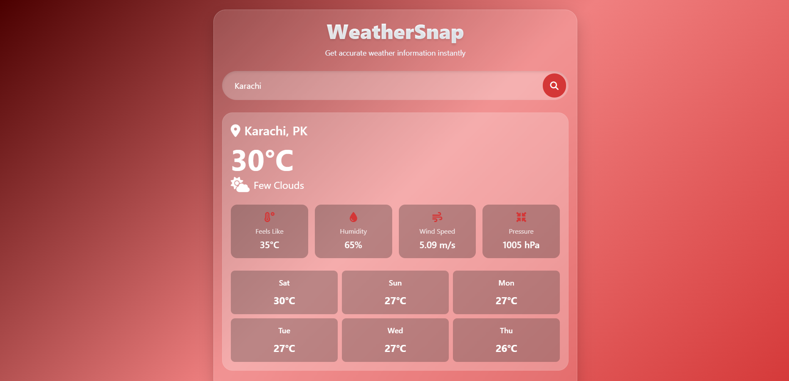

# ⛅ WeatherSnap - Professional Weather App

A sophisticated weather application that provides real-time weather data and 6-day forecasts for any city worldwide. Features a professional design with a fixed header and comprehensive weather information.

## ✨ Features

- 🌍 **Global City Search** - Find weather information for any city worldwide
- 🌡 **Temperature Display** - Celsius/Fahrenheit toggle support
- 📅 **6-Day Forecast** - Extended weather predictions
- 📊 **Detailed Weather Metrics** - Humidity, wind speed, pressure, feels-like temperature
- 🎨 **Professional Glassmorphism UI** - Modern design with blur effects
- 📱 **Fully Responsive** - Works perfectly on all devices
- ⚡ **Fast API Integration** - OpenWeatherMap API
- 🚨 **Error Handling** - User-friendly error messages
- 🌙 **Weather Icons** - Visual representation of weather conditions
- 📍 **Fixed Navigation Header** - Easy access to all features

## 🚀 Live Demo

Check out the live application here: [WeatherSnap Live Demo](https://your-deployment-link.com)

## 📸 Screenshots


*Desktop view of WeatherSnap*

## 🛠 Technologies Used

| Category         | Technologies                           |
|------------------|----------------------------------------|
| **Frontend**     | HTML5, JavaScript (ES6+)               |
| **API**          | OpenWeatherMap API                     |
| **Styling**      | CSS3, Bootstrap 5, Glassmorphism Design|
| **Icons**        | Font Awesome 6                         |
| **Animations**   | CSS Transitions & Transformations      |

## 📦 Installation

To run this project locally:

1. Clone the repository:
```bash
git clone https://github.com/your-username/WeatherSnap.git
```


## 📖 Usage

1. Enter a city name in the search box
2. Click the search button or press Enter
3. View current weather conditions and 6-day forecast

## 🌐 API Reference

This application uses the OpenWeatherMap API:
- Current Weather Data: `https://api.openweathermap.org/data/2.5/weather`
- 6-Day Forecast: `https://api.openweathermap.org/data/2.5/forecast`

## 🎨 Customization

You can customize the app by modifying the CSS variables in the `:root` selector:

```css
:root {
  --primary: #1a4b8c;    /* Primary color */
  --secondary: #2d76d9;  /* Secondary color */
  --accent: #34b3f1;     /* Accent color */
  --light: #f0f7ff;      /* Light color */
  --dark: #0e2a47;       /* Dark color */
}
```

<div align="center">

Made with ❤️ by [Faheem Ahmed](https://github.com/faheemcodes)

</div>